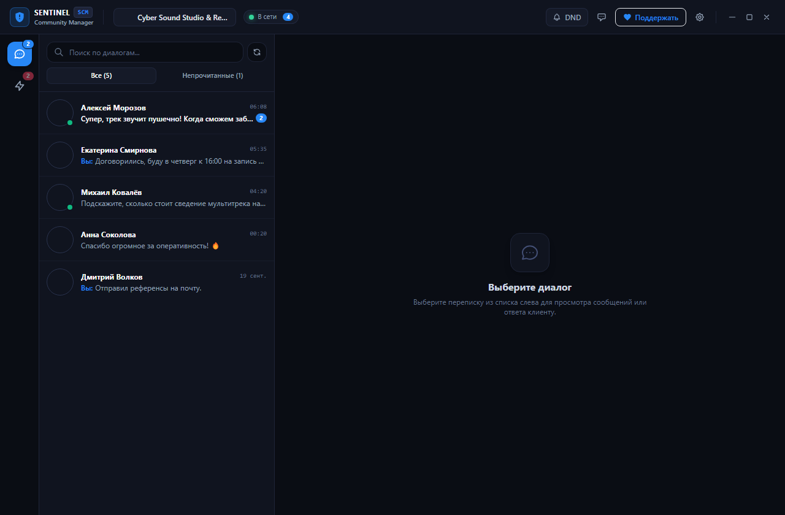
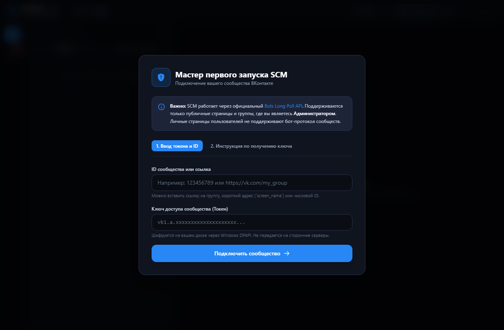

# 🛡️ Sentinel Community Manager (SCM)

[](LICENSE)
[](https://microsoft.com)
[](https://github.com/disface/sentinel-community-manager/releases/tag/v1.0.3)
[](https://www.electronjs.org/)
[](https://react.dev/)
[](https://www.typescriptlang.org/)

**Sentinel Community Manager (SCM)** — лёгкий, независимый и быстрый десктоп-клиент с открытым исходным кодом для прямого мониторинга сообществ ВКонтакте (групп и публичных страниц) под Windows.

Приложение работает автономно в фоновом режиме через официальный протокол **VK Bots Long Poll 5.199**, не требует постоянно открытой вкладки браузера, не содержит рекламы, телеметрии или сторонних облачных прокси-серверов.

---

## 📸 Скриншоты интерфейса

| Рабочее окно мессенджера (Чат и реакции) | Мастер первого подключения (Onboarding) |
| :---: | :---: |
|  |  |

---

## 🌟 Ключевые возможности

- **⚡ Bots Long Poll 5.199 & сетевая отказоустойчивость**:
  - Прямое сокет/HTTP Long Poll подключение к серверам VK с задержкой доставки менее 300 мс.
  - LRU-дедупликация событий (2 000 записей), исключающая задваивание сообщений и реакций при реконнектах.
  - Горячий рестарт сетевых сокетов при пробуждении ПК из спящего режима через `powerMonitor`.
  - Защита от потери позиции (`ts`) и локальная изоляция сбоев в пачке событий.
- **🚀 Zero-Latency UI & передовая подсистема реакций**:
  - **Мгновенный отклик (0 мс)**: установка и снятие реакций происходят моментально без сетевого лага, с автоматическим откатом стейта при сбое сети.
  - **Честное снятие реакций**: повторный клик по активной реакции сообщества честно удаляет её на сервере VK через `messages.deleteReaction`.
  - **Официальный маппинг VK API 5.199**: поддержка всех 16 официальных реакций (`1=❤️`, `2=🔥`, `3=😂`, `4=👍`, `5=💩`, `6=❓`, `7=😭`, `8=😡`, `9=👎`, `10=👌`, `11=😄`, `12=😏`, `13=🙏`, `14=😘`, `15=😍`, `16=🎉`).
  - **Информативные тултипы авторов**: отображение имён клиентов и сообщества при наведении курсора на бейджи реакций.
- **💬 Умный список диалогов (ConversationsList)**:
  - Индикация последних реакций прямо в превью диалогов (`❤️ Иван: [Текст]`, `🔥 Вы: [Текст]`).
  - Автоматическое поднятие диалога на первое место в списке (bubbling) при получении свежей реакции или сообщения.
  - Динамическая подгрузка диалогов и удобный поиск.
- **🔔 Windows 11 Toasts & Живая лента активности**:
  - Нативные системные push-уведомления Windows с эмодзи реакции, именем автора и переходом в чат в 1 клик.
  - Полноценная интеграция реакций в ленту активности (`ActivityFeed`) с янтарным бейджем `Реакция в ЛС` и быстрым переходом.
  - Трей Windows 11 с динамическим бейджем непрочитанных сообщений и режим «Не беспокоить» (DND).
- **🛡️ Аппаратная безопасность Windows DPAPI**:
  - Локальное аппаратное шифрование токенов сообщества через `safeStorage` (Windows DPAPI). Zero-hardcoded secrets в репозитории.
  - Атомарная запись на диск (`.tmp` → `fsyncSync` → `renameSync`), предотвращающая повреждение файлов конфигурации до 0 байт при сбоях питания.
  - Защита от затирания шифротекста при сбоях дешифрования (`tokenLocked`).
  - Sandbox-изоляция Electron, строгая Content-Security-Policy (CSP) и безопасная изоляция IPC.
- **🎨 Динамический Theme Engine & современный UI**:
  - 7 цветовых тем оформления (Классический синий, Изумрудный, Фиолетовый, Янтарный, Розовый рубин, Кибер-циан, Студийный кирпич).
  - Умный автоскролл чата, не сбивающий чтение истории, мемоизация ленты через `useMemo`, дебаунс настроек.
- **📦 Истинная портативность (True Portable)**:
  - Приложение не оставляет следов в системных папках `%APPDATA%`. Все настройки, история событий и кэши хранятся в каталоге `data/` рядом с исполняемым файлом. Защита от запуска копий процесса через `requestSingleInstanceLock`.
- **💬 Менеджер быстрых шаблонов ответов**:
  - Заготовки типовых ответов администратора (приветствие, контакты, график работы, доставка, реквизиты) в один клик.
- **☕ Прямая поддержка авторов**:
  - Встроенный блок финансовой благодарности через Систему быстрых платежей (Озон Банк) со сканированием QR-кода без комиссий.

---

## 🚀 Быстрый старт

1. Скачайте готовый файл **`Sentinel-Community-Manager-Portable.exe`** со страницы [Releases](https://github.com/disface/sentinel-community-manager/releases/latest) (текущая стабильная версия: **v1.0.3**; подробности см. в [CHANGELOG.md](CHANGELOG.md)).
2. Поместите его в любую удобную папку (например, `D:\Apps\SCM`) и запустите.
3. В открывшемся Мастере настройки укажите:
   - **ID или короткий адрес сообщества** (например, `club12345` или `my_public`).
   - **Ключ доступа сообщества (API Токен)** (в окне встроена пошаговая подсказка, как получить ключ в настройках группы за 1 минуту).
4. Нажмите **«Подключить и войти»** — SCM проверит валидность ключа через API, подтянет аватар и название сообщества и запустит фоновый мониторинг!

> [!NOTE]
> Приложение работает **только с сообществами** (группами и публичными страницами), где у вас есть права Администратора. Личные страницы пользователей через данный API не поддерживаются.

---

## 🛠️ Сборка из исходного кода

### Требования
- **Node.js**: версия 20.x или 22.x LTS.
- **ОС**: Windows 10 / 11 64-bit.
- **Git**

### Инструкция по сборке

```powershell
# 1. Клонирование репозитория
git clone https://github.com/disface/sentinel-community-manager.git
cd sentinel-community-manager

# 2. Установка зависимостей
npm install

# 3. Запуск в режиме разработки
npm run app:dev

# 4. Сборка портативного .exe
npm run dist:portable
```

После выполнения команды `npm run dist:portable` готовый исполняемый файл появится в папке `release/Sentinel-Community-Manager-Portable.exe`.

---

## 🏛️ Архитектура проекта

```
sentinel-community-manager/
├── electron/                 # Бэкенд Electron
│   ├── main.ts               # Инициализация окна, трея, Single Instance Lock
│   ├── preload.ts            # Безопасный контекстный мост (window.scmAPI)
│   ├── store-service.ts      # Шифрованное хранилище DPAPI (safeStorage)
│   └── vk-service.ts         # Движок Bots Long Poll 5.199 и VK API
├── src/                      # Фронтенд (React 19 + TypeScript + Tailwind)
│   ├── assets/               # Статические изображения и QR-коды
│   ├── components/
│   │   ├── ActivityFeed.tsx  # Лента активности сообщества (лайки, подписки, комментарии)
│   │   ├── ChatView.tsx      # Полноэкранный мессенджер с реакциями и вложениями
│   │   ├── Header.tsx        # Шапка с выбором тем, статусом и кнопками
│   │   ├── OnboardingModal.tsx # Мастер первого подключения сообщества
│   │   ├── SettingsModal.tsx # Настройки приложения и переподключение
│   │   ├── SupportModal.tsx  # Окно «Поддержать» с QR-кодом Озон Банк СБП
│   │   └── TemplateEditorModal.tsx # Редактор быстрых шаблонов ответов
│   ├── theme/
│   │   └── ThemeContext.tsx  # Менеджер динамических CSS-переменных темы
│   ├── types/
│   │   └── scm.ts            # Строгая типизация моделей данных
│   ├── App.tsx               # Главный контейнер приложения
│   ├── index.css             # Стили Tailwind и кастомные скроллбары
│   └── main.tsx              # Точка входа React
├── package.json              # Зависимости и скрипты сборки
├── tailwind.config.js        # Настройка CSS-переменных палитры
├── tsconfig.json             # Настройки TypeScript для фронтенда
├── tsconfig.electron.json    # Настройки TypeScript для Electron
└── vite.config.ts            # Конфигурация сборщика Vite
```

---

## 🔒 Безопасность и приватность

1. **Изоляция контекста (`contextIsolation: true`)**:
   Рендерер не имеет прямого доступа к Node.js или системным API; взаимодействие происходит строго через типизированные IPC-каналы в `preload.ts`.
2. **Локальное шифрование токенов**:
   Ключ доступа не хранится в открытом JSON-файле — он шифруется с помощью встроенного механизма **Windows DPAPI** (`electron.safeStorage`).
3. **Безопасные внешние ссылки**:
   Любые клики по ссылкам проверяются и открываются исключительно в системном браузере пользователя (`shell.openExternal`) по протоколам `http://` и `https://`.
4. **Никакой телеметрии**:
   SCM обращается **только к официальным серверам API ВКонтакте** (`api.vk.com`, Long Poll сервера). Никаких сторонних серверов сбора аналитики или трекеров.

---

## 👥 Создатели и благодарности

- **Концепция, UI/UX и продакшн**: Максим sum1nus ([@disface](https://github.com/disface))
- **Архитектура ядра и разработка**: Antigravity AI (Google DeepMind)

### Использованные открытые библиотеки и технологии:
- [Electron](https://www.electronjs.org/) — среда десктопного выполнения (MIT License).
- [React](https://react.dev/) — библиотека интерфейса (MIT License).
- [Vite](https://vitejs.dev/) — быстрый инструмент сборки (MIT License).
- [Tailwind CSS](https://tailwindcss.com/) — утилитарный CSS-фреймворк (MIT License).
- [Lucide Icons](https://lucide.dev/) — набор иконок (ISC License).
- [VK Community API & Bots Long Poll](https://dev.vk.com/) — официальный протокол обмена данными (VK LLC).

---

## ☕ Поддержка проекта

Sentinel Community Manager распространяется свободно и абсолютно бесплатно. Если приложение помогает вам и вашему сообществу, вы можете поддержать разработку переводом через Систему быстрых платежей (СБП) без комиссии:

- **Прямая ссылка для перевода**: [Перевести через СБП (Озон Банк)](https://finance.ozon.ru/apps/sbp/ozonbankpay/01a0bc28-c9be-75eb-807d-e5abcaa7cc2d)
- Либо отсканируйте QR-код Озон Банка в окне «Поддержать» прямо в приложении.

---

## 📄 Лицензия

Проект распространяется под открытой лицензией [MIT](LICENSE).
